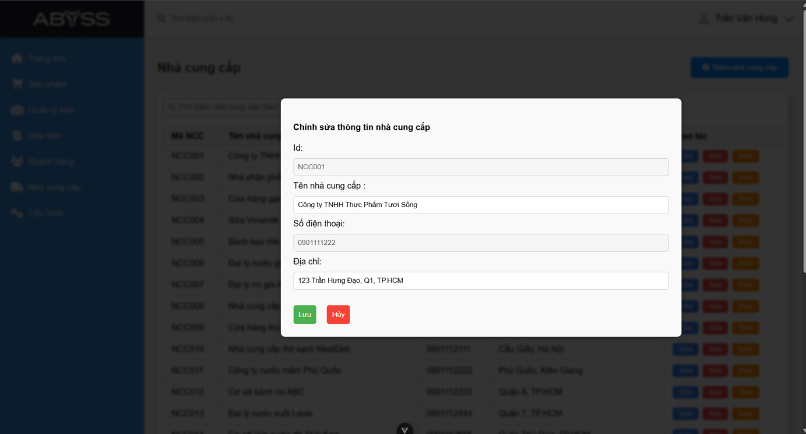
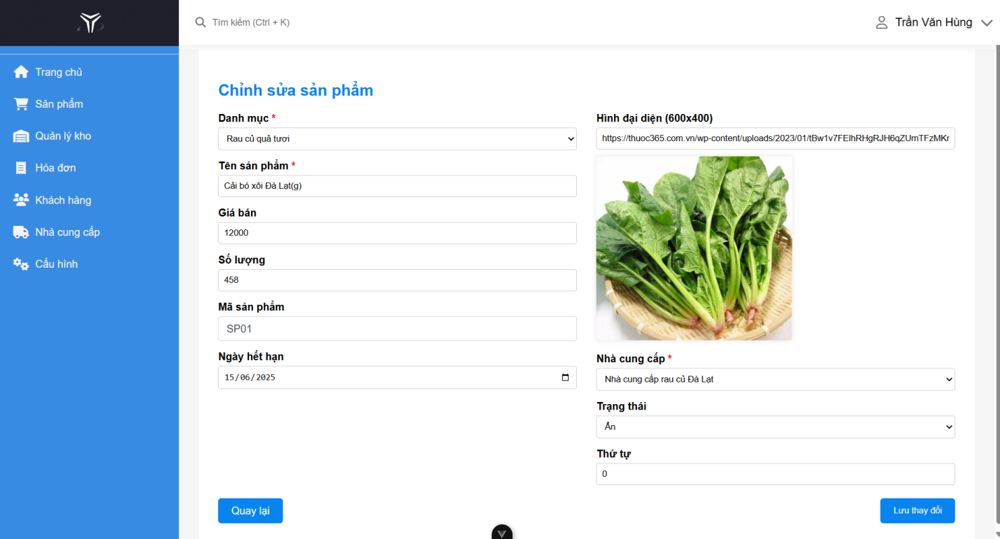

# 🛒 Mini Supermarket Management System

## 📌 Overview
This project is a **Mini Supermarket Management System** developed as part of our Java programming coursework.  
The main goal is to provide a solution for managing supermarket operations such as **employees, customers, suppliers, products, inventory, and sales orders** in a more systematic and efficient way.  

With a simple and intuitive user interface, the system helps reduce manual workload and improve management accuracy.

---

## ⚙️ Tech Stack
- **Java** (Swing for GUI development)  
- **MySQL / XAMPP** (Database management)  
- **JDBC** (Database connectivity)  
- **Visual Studio Code** (IDE)  
- **MVC Architecture**

---

## 🔑 Key Features

### 👨‍💼 Admin / Manager
- User authentication (Login / Logout / Register)  
- Manage Employees (Add, Edit, Delete, Search)  
- Manage Customers (Add, Edit, Delete, Search)  
- Manage Suppliers (Add, Edit, Delete, Search)  
- Manage Products (Add, Edit, Delete, Update details)  
- Manage Purchase Orders  
- Manage Sales Orders  
- Manage Inventory  
- View Reports & Cashbook  

### 👩‍💻 Staff
- User authentication (Login / Logout / Register)  
- Manage Customers (Add, Edit, Delete, Search)  
- Manage Suppliers (Add, Edit, Delete, Search)  
- Manage Products (Add, Edit, Delete, Update details)  
- Manage Purchase Orders  
- Manage Sales Orders  
- Manage Inventory  

---

## 🖼️ Screenshots

### 1. Welcome & Authentication
- **Welcome Page:**  -  The landing page displayed when launching the application.

  

- **Login** – Allows staff or managers to log in to the system.
  
  

- **Register** – Allows new staff to register; managers cannot register via this page.
  
  

---

### 2. Employee Management
- **View Employees List** – Display a list of all employees with details such as ID, Name, Phone, Role, and Salary.
  
  

- **Search Employee** – Search employees by keyword (e.g., Name or ID).
  
  

- **View Employee Details** – View detailed information of a selected employee.
  
  

- **Add Employee** – Add a new employee with complete information.
  
  

- **Edit Employee** – Edit information of an existing employee (Name, Phone, Role, Username, Password, Salary).
  
  

- **Delete Employee** – Remove an employee from the system after confirmation.

---

### 3. Customer Management
- **View Customers** – Display a list of customers with ID, Name, Phone, Birthdate, Points, and Rank.
  
  

- **Add Customer** – Add a new customer to the system.
  
  

- **Edit Customer** – Edit Name and Birthdate of a customer; other information is read-only.
  
  

- **Delete Customer** – Remove a customer from the system after confirmation.

---

### 4. Supplier Management
- **View Suppliers** – Display a list of suppliers with ID, Name, Phone, and Address.
  
   

- **Search Supplier** – Search suppliers by keyword.
  
   

- **View Supplier Details** – Display detailed information of a selected supplier and their products.
  
   

- **Add Supplier** – Add a new supplier with complete information.
  
    

- **Edit Supplier** – Edit information of a supplier (Name, Phone, Address).
  
    

- **Delete Supplier** – Remove a supplier from the system after confirmation.

---

### 5. Product Management
- **View Products** – Display a list of products with ID, Name, Quantity, Price, Category, and Brand.
  
    

- **Search Product** – Search products by keyword.
  
   

- **Add Product** – Add a new product with complete information.
  
    

- **Edit Product** – Edit information of an existing product (Name, Price, Quantity, Category, Brand).
  
    

- **Delete Product** – Remove a product from the system.

---

### 6. Sales Order Management
- **View Order List** – Display a list of all sales orders.
  
    

- **View Order Details** – View detailed information of a selected sales order.
  
    

- **Create Order** – Create a new sales order, select products, and enter customer information.
  
    

---

### 7. Purchase Order Management
- **View Purchase Order List** – Display a list of all purchase orders.
  
    

- **View Order Details** – View details of a selected purchase order.
  
    

- **Create Purchase Order** – Create a new purchase order, select products, and enter quantities.
  
    

---

### 8. Inventory Management
- **View Stock Levels** – Display the current stock levels of all products.
  
    

- **Search Inventory** – Search products in the inventory by keyword.
  
   

---

### 9. Reports & Statistics
- **Sales Reports by Day** – Display daily sales reports.
  
    

- **Sales Reports by Month** – Display monthly sales reports.
  
     

- **Cash Book** – Display the cash book including sales, purchase orders, operational costs, and actual profit.
  
    
